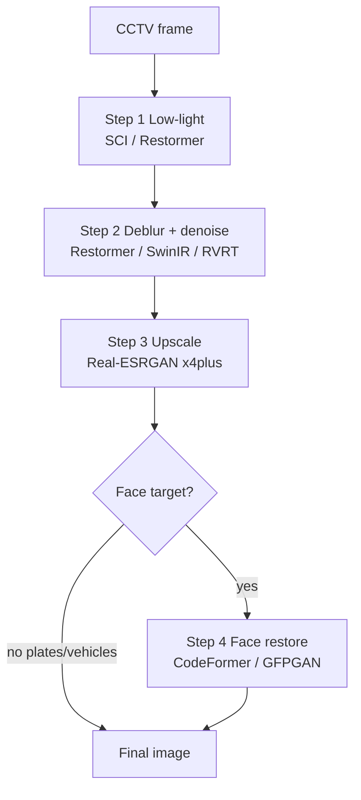

# CCTV Adaptive Restoration Pipeline

**Goal:** combine specialized models in a **chain** — one model is not enough. Each stage has a job; skip stages when metrics say the frame does not need them.

**Forensic warning:** GAN / codebook stages (Real-ESRGAN, CodeFormer) can **hallucinate**. Prefer ROI crops + bakeoffs; disclose generative steps. Temporal fusion (RVRT / BasicVSR++) is safer for plates than inventing digits.

## Repo documentation

- **English only** for `README.md` and `work/*/RESULTS.md`.
- **Surgical edits:** change only what changed in README (one table row, command, or verdict). Append new bakeoff rows/sections **below** existing content; do not rewrite or reshuffle unrelated sections.
- **Generic goal** — plates, faces, vehicles. No private case names in the public README.
- **README images:** `` with files under `work/bakeoff/`. Never swap images for URL-only text. Raw URLs: `work/bakeoff/cut2/image_urls.md`. No emojis.
- These edit rules live in **skills only** — never put “Maintaining this README” (or similar agent/dev policy) in the public README.
- Public pipeline overview: [README.md](../../../README.md) § “Target pipeline”.

Related skills: [realesrgan](../realesrgan/SKILL.md), [rvrt-video-restoration](../rvrt-video-restoration/SKILL.md), [vrt-video-restoration](../vrt-video-restoration/SKILL.md), [codeformer](../codeformer/SKILL.md).

## Baseline chain (static)

Do **not** upscale first on dark frames — darkness noise scales with SR.



| Step | Role | Preferred repos | Skip when |
|------|------|-----------------|-----------|
| 1 | Lift darkness / shadows | [SCI](https://github.com/vis-opt-group/SCI), [Restormer](https://github.com/swz30/Restormer) low-light | Mean luminance already high |
| 2 | Motion blur + compression noise | Restormer, [SwinIR](https://github.com/JingyunLiang/SwinIR), [RVRT](https://github.com/JingyunLiang/RVRT) | Laplacian variance already sharp |
| 3 | Super-resolution / plates text | [Real-ESRGAN](https://github.com/xinntao/Real-ESRGAN) `RealESRGAN_x4plus` | Always after clean+bright for ID tasks |
| 4 | Face detail (optional) | [CodeFormer](https://github.com/sczhou/CodeFormer), GFPGAN | Plate-only jobs |

### Pseudocode (sequential I/O)

```python
img = cv2.imread("cctv_frame.jpg")
img = model_sci_lowlight(img)          # step 1
img = model_restormer_deblur(img)      # step 2
img = model_realesrgan_upscale(img)    # step 3
img = model_codeformer_face(img)       # step 4 if face ROI
cv2.imwrite("out.jpg", img)
```

**Plate path:** steps 1–3 only (no CodeFormer). **Face path:** all four on a **zoomed ROI**, not full 1080p.

## Adaptive improvements (prefer these)

### 1. Adaptive pipeline selector

Static chains over-expose bright day frames if low-light always runs.

```python
gray = cv2.cvtColor(img, cv2.COLOR_BGR2GRAY)
brightness = gray.mean()                    # 0–255
blur_var = cv2.Laplacian(gray, cv2.CV_64F).var()

if brightness < 50:
    img = model_low_light(img)
if blur_var < 100:
    img = model_deblur(img)
# then upscale / face as needed
```

Tune thresholds per camera; bakeoff before hard-coding.

### 2. ROI crop → enhance → stitch

Full-frame SR blows VRAM (e.g. 2K→8K). Detect plate/face (YOLO / RetinaFace), crop, run DL on the patch, paste back.

```text
frame → detect (YOLO) → crop ROI → Restormer/SwinIR/Real-ESRGAN/CodeFormer → stitch to coords
```

Use this for `work/cut-motor-2308-bakeoff` and plate crops. Script helper: `scripts/extract_roi_bakeoff.py`.

### 3. Multi-frame temporal fusion

Single stills lack pixel evidence under motion blur. Take ±2 frames and run VSR / temporal restore ([BasicVSR++](https://github.com/ckkelvinchan/BasicVSR_PlusPlus), Real-BasicSR, **RVRT**, VRT) so clearer frames fill missing digits.

### 4. Face vs non-face soft mask

CodeFormer on a crop can warp clothes/background. Run Real-ESRGAN on the crop and CodeFormer on the face; blend with a face-landmark soft mask (`cv2.addWeighted` / alpha mask).

## Suggested project layout (when implementing)

```text
cctv-enhancement/
├── scripts/              # orchestration (this repo today)
├── core/                 # future: analyzer.py, pipeline.py
├── weights/              # .pth shared weights (gitignored / LFS)
└── tools/                # cloned upstreams (gitignored)
    ├── Real-ESRGAN/
    ├── CodeFormer/
    ├── Restormer/
    └── RVRT/
```

Keep upstream clones under `tools/` unchanged; call them from thin wrappers in `scripts/`.

## Agent rules

1. Prefer **adaptive** gates over always-on low-light.
2. Prefer **ROI** over full-frame SR on 4GB GPUs.
3. Prefer **temporal** models when multiple frames exist.
4. Always small-frame **bakeoff** before full video.
5. Document winners in `work/*/RESULTS.md` and only then update README surgically.
