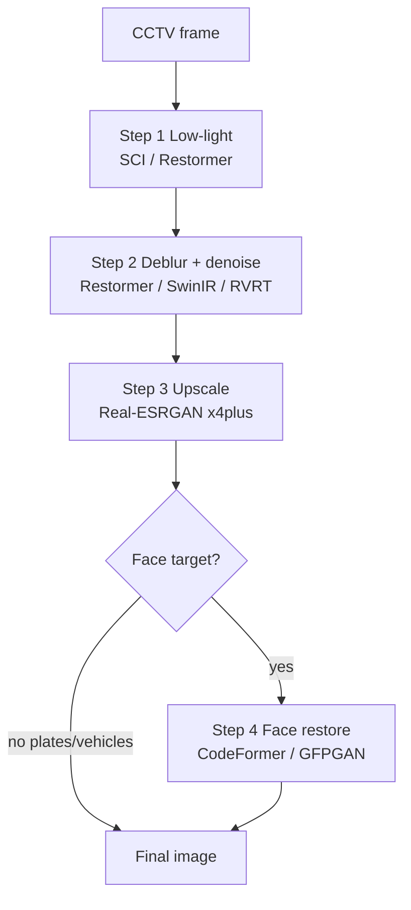

# CCTV Adaptive Restoration Pipeline

**Goal:** combine specialized models in a **chain** — one model is not enough. Each stage has a job; skip stages when metrics say the frame does not need them.

**Forensic warning:** GAN / codebook stages (Real-ESRGAN, CodeFormer) can **hallucinate**. Prefer ROI crops + bakeoffs; disclose generative steps. Temporal fusion (RVRT / BasicVSR++) is safer for plates than inventing digits.

## Repo documentation

- **English only** for `README.md` and `work/*/RESULTS.md`.
- **Surgical edits:** change only what changed in README (one table row, command, or verdict). Append new bakeoff rows/sections **below** existing content; do not rewrite or reshuffle unrelated sections.
- **Generic goal** — plates, faces, vehicles. No private case names in the public README.
- **README images:** `` with files under `work/bakeoff/`. Never swap images for URL-only text. Raw URLs: `work/bakeoff/cut2/image_urls.md`. No emojis.
- These edit rules live in **skills only** — never put “Maintaining this README” (or similar agent/dev policy) in the public README.
- Public pipeline overview: [README.md](../../../README.md) § “Target pipeline”.

Related skills: [testing-lab](../testing-lab/SKILL.md), [realesrgan](../realesrgan/SKILL.md), [rvrt-video-restoration](../rvrt-video-restoration/SKILL.md), [vrt-video-restoration](../vrt-video-restoration/SKILL.md), [codeformer](../codeformer/SKILL.md).

## Topaz Video AI logic (temporal rendering)

Topaz still processes **frame sequences**, not isolated stills. It uses **temporal multi-frame networks** — memory of past/future frames — to reduce flicker and borrow sharp pixels from neighbors.

```text
video → frame buffer [F_{t-2} … F_{t+2}]
     → motion alignment (optical flow / deformable conv)
     → temporal fusion (sharp pixels from neighbors fill blur in F_t)
     → consistency pass (reduce frame-to-frame flicker)
     → write enhanced sequence
```

| Topaz model (commercial) | Open-source analogue | Repo role in this project |
|--------------------------|----------------------|---------------------------|
| Proteus / Artemis (denoise + sharpen) | **RVRT**, VRT, BasicVSR++ | Cat **B** — temporal denoise/deblur, native res |
| Gaia / Theia (detail / fidelity SR) | Real-ESRGAN, RTVSR | Cat **C** — upscale after temporal clean |
| Iris (face video) | CodeFormer video mode | Cat **E** — generative face; last in chain |
| Apollo / Chronos (interpolation) | RIFE | Future — raise FPS before or after restore |

### When to use which mode

| You have | Use | Why |
|----------|-----|-----|
| **Still images only** (screenshot / exported frame) | Single-image path: ROI → SR (PyTorch `C12`) | No temporal evidence left |
| **Video / frame sequence** (.mp4 or `datasets/*/src/` multi-frame) | Temporal path: RVRT/VRT **first**, then SR | Neighbor frames can supply missing plate/edge detail |
| Full CCTV file | Extract clip → `datasets/` → **lab per experiment** | Never overwrite prior labs |

### Python buffer pattern (Topaz-style skeleton)

```python
buffer: list[np.ndarray] = []
WINDOW = 15  # model-dependent; RVRT uses 16-frame clips

while cap.read():
    buffer.append(frame)
    if len(buffer) >= WINDOW:
        enhanced = temporal_model(buffer)  # RVRT / BasicVSR++
        for ef in enhanced:
            writer.write(ef)
        buffer = buffer[-OVERLAP:]  # overlap for continuity
```

This repo: frame bakeoffs use `scripts/bakeoff_hybrid.py` on `work/datasets/<name>/src/`; each run → `work/labs/<name>/lab-NNN-<slug>/`. See [testing-lab](../testing-lab/SKILL.md).

## Baseline chain (static)

Do **not** upscale first on dark frames — darkness noise scales with SR.



| Step | Role | Preferred repos | Skip when |
|------|------|-----------------|-----------|
| 1 | Lift darkness / shadows | [SCI](https://github.com/vis-opt-group/SCI), [Restormer](https://github.com/swz30/Restormer) low-light | Mean luminance already high |
| 2 | Motion blur + compression noise | Restormer, [SwinIR](https://github.com/JingyunLiang/SwinIR), [RVRT](https://github.com/JingyunLiang/RVRT) | Laplacian variance already sharp |
| 3 | Super-resolution / plates text | [Real-ESRGAN](https://github.com/xinntao/Real-ESRGAN) `RealESRGAN_x4plus` | Always after clean+bright for ID tasks |
| 4 | Face detail (optional) | [CodeFormer](https://github.com/sczhou/CodeFormer), GFPGAN | Plate-only jobs |

### Pseudocode (sequential I/O)

```python
img = cv2.imread("cctv_frame.jpg")
img = model_sci_lowlight(img)          # step 1
img = model_restormer_deblur(img)      # step 2
img = model_realesrgan_upscale(img)    # step 3
img = model_codeformer_face(img)       # step 4 if face ROI
cv2.imwrite("out.jpg", img)
```

**Plate path:** steps 1–3 only (no CodeFormer). **Face path:** all four on a **zoomed ROI**, not full 1080p.

## Adaptive improvements (prefer these)

### 1. Adaptive pipeline selector

Static chains over-expose bright day frames if low-light always runs.

```python
gray = cv2.cvtColor(img, cv2.COLOR_BGR2GRAY)
brightness = gray.mean()                    # 0–255
blur_var = cv2.Laplacian(gray, cv2.CV_64F).var()

if brightness < 50:
    img = model_low_light(img)
if blur_var < 100:
    img = model_deblur(img)
# then upscale / face as needed
```

Tune thresholds per camera; bakeoff before hard-coding.

### 2. ROI crop → enhance → stitch

Full-frame SR blows VRAM (e.g. 2K→8K). Detect plate/face (YOLO / RetinaFace), crop, run DL on the patch, paste back.

```text
frame → detect (YOLO) → crop ROI → Restormer/SwinIR/Real-ESRGAN/CodeFormer → stitch to coords
```

Use this for `work/cut-motor-2308-bakeoff` and plate crops. Script helper: `scripts/extract_roi_bakeoff.py`.

### 3. Multi-frame temporal fusion

Single stills lack pixel evidence under motion blur. Take ±2 frames and run VSR / temporal restore ([BasicVSR++](https://github.com/ckkelvinchan/BasicVSR_PlusPlus), Real-BasicSR, **RVRT**, VRT) so clearer frames fill missing digits.

### 4. Face vs non-face soft mask

CodeFormer on a crop can warp clothes/background. Run Real-ESRGAN on the crop and CodeFormer on the face; blend with a face-landmark soft mask (`cv2.addWeighted` / alpha mask).

## Classified bakeoff — chains mode (default)

**Do not** run 13 parallel folders by default. Use linear chains with a **final output**:

```powershell
# Default: A→B→C→D per goal + outputs/final/
python scripts/bakeoff_hybrid.py --dataset cut-motor-2308 --new-lab "chains-v3" --mode chains

# Full tool matrix only when comparing all tools side-by-side
python scripts/bakeoff_hybrid.py --dataset cut-motor-2308 --new-lab "explore-all" --mode explore
```

| Goal | Chain | Upscayl step |
|------|-------|--------------|
| motor | A baseline → B CLAHE → **Upscayl Ultrasharp ×2** (optional) → C PyTorch SR ×2 | Step 03 — skipped if `tools/upscayl-ncnn/` missing |
| plate | A plate crop → B CLAHE → C SR ×3 | No Upscayl (crop too small) |
| face | A face crop → B CLAHE → C SR ×2 → D CodeFormer | No Upscayl before face generative |

**Before plate chain:** open `work/datasets/cut-motor-2308/crops/plate_ref.png` — must show front plate, not rear tire. Regions: `meta.json` → `focus_regions` via `scripts/focus_regions.py`.

Lab docs: `CHAIN.md`, `WINNERS.md`, `outputs/final/`. See [testing-lab](../testing-lab/SKILL.md).

### Explore mode (optional matrix)

Letter categories under `outputs/explore/` — one role per folder:

| Cat | Stage | Tool | Output folder pattern |
|-----|-------|------|------------------------|
| **A** | Baseline | — | `A00-baseline-src/` |
| **B** | Temporal clean | RVRT / VRT | `B01-rvrt-deblur/`, `B04-clahe-brighten/` |
| **C** | Upscale only | PyTorch SR x2, ncnn x4 | `C12-pytorch-sr-x2/`, `C13-plate-*` |
| **D** | Hybrid chain | RVRT→SR, SR→CodeFormer | `D20-rvrt-then-sr/`, `D22-pytorch-sr-codeformer/` |
| **E** | Face generative | CodeFormer (last) | `E30-codeformer-facezoom/` |

```powershell
python scripts/bakeoff_hybrid.py --dataset cut-motor-2308 --new-lab "explore-v2" --mode explore
```

### Anti-patterns (cut-motor lessons)

| Mistake | Why it fails |
|---------|----------------|
| Plate crop at `y 0.48–0.92` | Hits **rear tire** — plate is front fender `y 0.55–0.73` |
| 13 parallel outputs without chain | User cannot see A→B→C→D or final result |
| CodeFormer on full 1080p | 0 face detections — face ~20px tall |
| CodeFormer alone on ROI | Often 0 detections; `final_results/` is passthrough |
| ncnn Real-ESRGAN x2 on small ROI | **Tile-mosaic grid** — use PyTorch SR or ncnn x4 |
| Double-crop in focus grid | C14/E30 already cropped — re-cropping → gray tiles |
| Skipping `crops/plate_ref.png` check | Wrong region → all plate SR wasted |

### Correct chain for motor ROI (`cut-motor-2308`)

```text
Verify crops/plate_ref.png + face_ref.png
  → chains/plate:  crop → B04 CLAHE → C13 PyTorch SR ×3  → outputs/final/plate_*.png
  → chains/face:   crop → B04 CLAHE → C14 SR ×2 → E30 CF → outputs/final/face_*.png
  → chains/motor:  A00 → B04 CLAHE → Upscayl ×2 (opt) → C12 SR ×2 → outputs/final/motor_*.png
```

**lab-002 winners (frame_002):** see `work/labs/cut-motor-2308/lab-002-.../WINNERS.md`  
**Plate/face OCR:** still not achieved — crop was wrong in lab-002; fixed in `focus_regions.py`.

```text
cctv-enhancement/
├── scripts/              # orchestration (this repo today)
├── core/                 # future: analyzer.py, pipeline.py
├── weights/              # .pth shared weights (gitignored / LFS)
└── tools/                # cloned upstreams (gitignored)
    ├── Real-ESRGAN/
    ├── CodeFormer/
    ├── Restormer/
    └── RVRT/
```

Keep upstream clones under `tools/` unchanged; call them from thin wrappers in `scripts/`.

## Agent rules

1. Prefer **adaptive** gates over always-on low-light.
2. Prefer **ROI** over full-frame SR on 4GB GPUs.
3. Prefer **temporal** models when multiple frames exist.
4. Always small-frame **bakeoff** before full video.
5. Document winners in `work/labs/<dataset>/<lab>/RESULTS.md`; promote to README surgically.
6. **New test → new lab** (`--new-lab`). See [testing-lab](../testing-lab/SKILL.md).
