# CCTV Enhancement (experimental)

Public **testing repo** for sharpening real CCTV footage where details matter — license plates, faces, and vehicle outlines.

> **Honest status:** No pipeline has produced a result clearly better than the originals for identification. Outputs may look smoother but often **add artifacts or hallucinate detail** — not acceptable for evidence use. This is **work in progress**, not a finished product.

Contributions welcome — especially side-by-side crops of plates/faces.

Repo: [proton-maker/CCTV-Enhancement-experimental](https://github.com/proton-maker/CCTV-Enhancement-experimental)

## Problem

Sample footage (`Original/CUT/cut2.mkv`, `ch07`, `ch09`):

- Heavy blur and compression (HEVC/H.264, low bitrate)
- Uneven lighting
- Small, distant plates and faces
- Long clips; laptop GPUs (e.g. RTX 3050 4GB) are tight on VRAM

**Goal:** make plates, faces, and vehicle outlines **more readable** without inventing pixels. **Not achieved yet.**

## Tools used in testing (not in this repo)

`tools/` is **gitignored**. Install locally — see [tools/README.md](tools/README.md).

| Tool | Upstream | Role in this project |

|------|----------|----------------------|

| **VRT** | [JingyunLiang/VRT](https://github.com/JingyunLiang/VRT) | Video denoise/deblur (no upscale) — `scripts/restore_cctv.py` |

| **RVRT** | [JingyunLiang/RVRT](https://github.com/JingyunLiang/RVRT) | Lighter temporal deblur/denoise — `scripts/bakeoff_rvrt.py` |

| **Real-ESRGAN ncnn** | [Real-ESRGAN-ncnn-vulkan](https://github.com/xinntao/Real-ESRGAN-ncnn-vulkan) | Frame upscale bakeoff |

| **Upscayl** | [upscayl/upscayl](https://github.com/upscayl/upscayl) | Extra ncnn models |

| **upscayl-ncnn** | [upscayl/upscayl-ncnn](https://github.com/upscayl/upscayl-ncnn) | Upscayl CLI (`upscayl-bin.exe`) |

| **CodeFormer** | [sczhou/CodeFormer](https://github.com/sczhou/CodeFormer) | Face restoration on zoomed ROI — `scripts/bakeoff_hybrid.py` |

| **FFmpeg** | [ffmpeg.org](https://ffmpeg.org/) | Frame extract / remux |

## Bakeoff results (`cut2` — `frame_007`)

8 frames from `Original/CUT/cut2.mkv`. Local outputs: `work/cut2-bakeoff/` (see `RESULTS.md` there).

Reproduce upscale bakeoff: `python scripts/bakeoff_upscayl.py`  

Reproduce RVRT: `scripts\run_rvrt_deblur.bat` (Windows) or `python scripts/bakeoff_rvrt.py`  

Rebuild comparison images: `python scripts/build_bakeoff_docs.py`

### Face / upper-body crop

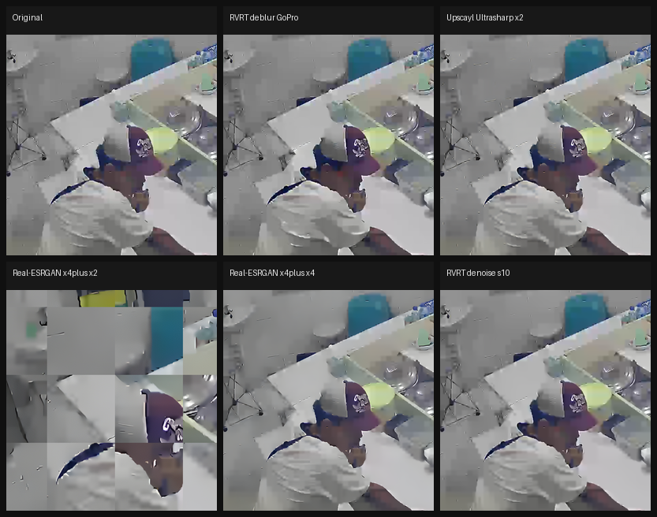

| Run | Verdict | Main issue |
|-----|---------|------------|
| **Original** | Baseline | Blur, noise; face unreadable |
| **RVRT deblur (GoPro)** | Marginal | Slightly smoother; **no readable face** |
| **RVRT denoise (σ=10)** | Marginal | Similar to deblur; **no ID gain** |
| **Real-ESRGAN x4plus x2** | **Failed** | **Tile mosaic** (grid squares) — unusable |
| **Real-ESRGAN x4plus x4** | Poor | Slight smoothing; still blurry; ~35MB/frame |
| **Upscayl Ultrasharp x2** | **Best upscale** | Coherent frame; slightly sharper; **face still unreadable** |
| **Upscayl Remacri / HiFi / Standard x2** | Similar | No identification gain |

**Winner (upscale):** `work/cut2-bakeoff/outputs/05-upscayl-ultrasharp-s2/`  

**Best native-res temporal:** `09-rvrt-deblur-gopro` / `10-rvrt-denoise-s10` — cleaner noise only, not sharper identity

### Full frame (downscaled strip)

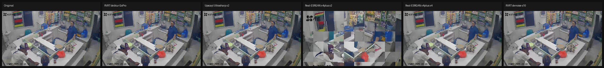

### Per-crop (Real-ESRGAN)

| Original | x4plus x2 | x4plus x4 |
|----------|-----------|-----------|
|  | 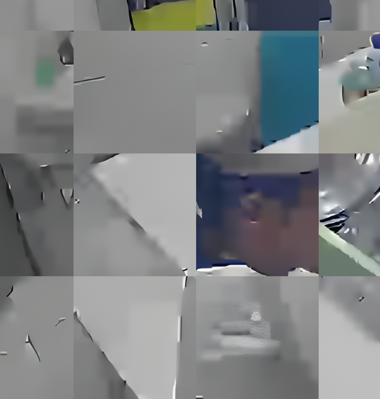 | 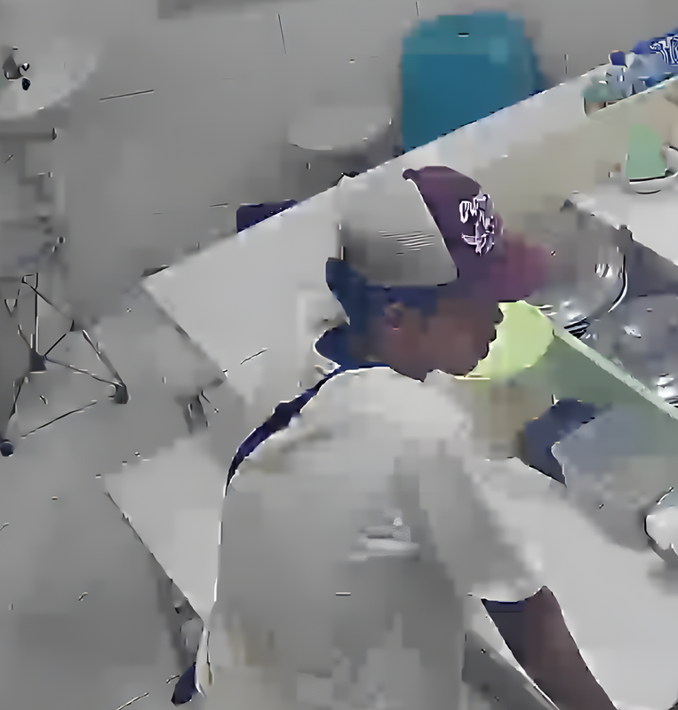 |

| anime x2 | animevideov3 x2 |
|----------|-----------------|
| 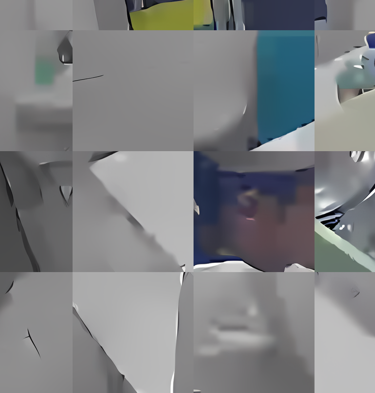 | 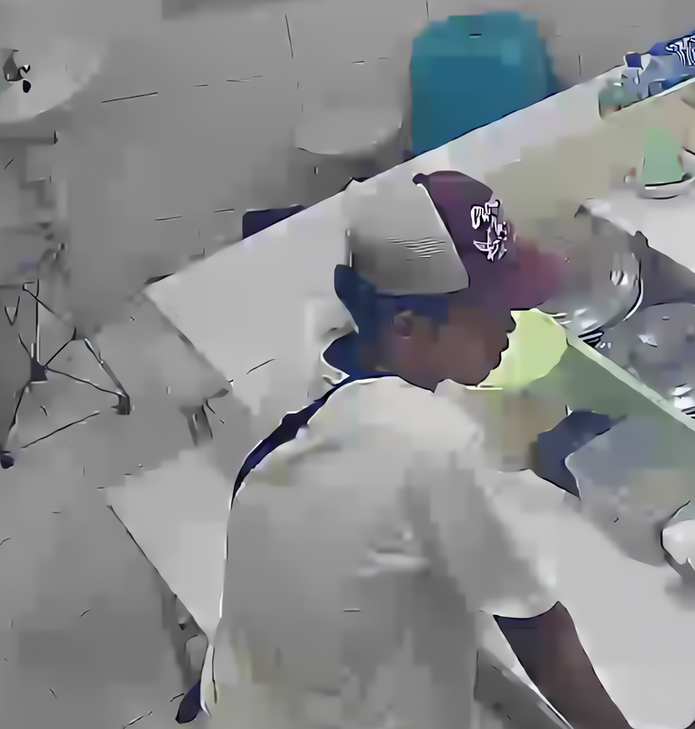 |

## Bakeoff results (`cut-motor-2308` — motorcycle stall, `frame_002`)

Second test clip: red scooter + rider at a food stall (`Original/CUT/cut.mkv`, **23:17.33–23:18**).  
Dataset: `work/datasets/cut-motor-2308/` (3 ROI frames, ×2 LANCZOS zoom).  
Lab: `work/labs/cut-motor-2308/lab-002-goal-plate-face-motor-scene/` — full notes in `RESULTS.md` and `WINNERS.md` there.

Reproduce (chains mode, recommended):

```powershell
python scripts/bakeoff_hybrid.py --dataset cut-motor-2308 --new-lab "chains-v3" --mode chains --goals plate,face,motor,scene,brighten
```

Explore all tools in parallel (old layout): `--mode explore` → `outputs/explore/`.

### Problem on this clip

| Issue | Why it blocks identification |
|-------|------------------------------|
| Night / uneven lighting | Rider and bike nearly black in raw ROI |
| Motion blur + HEVC compression | Plate is a white smear, not characters |
| Tiny face in ROI | ~40px tall even after ×2 extract — detectors fail |
| Wrong plate crop (lab-002 bug) | Crop targeted **rear tire** instead of front plate below headlight |

Full scene (1080p) vs zoomed ROI:

| Full frame (`23:17.67`) | ROI baseline (`frame_002`) |
|-------------------------|----------------------------|
| 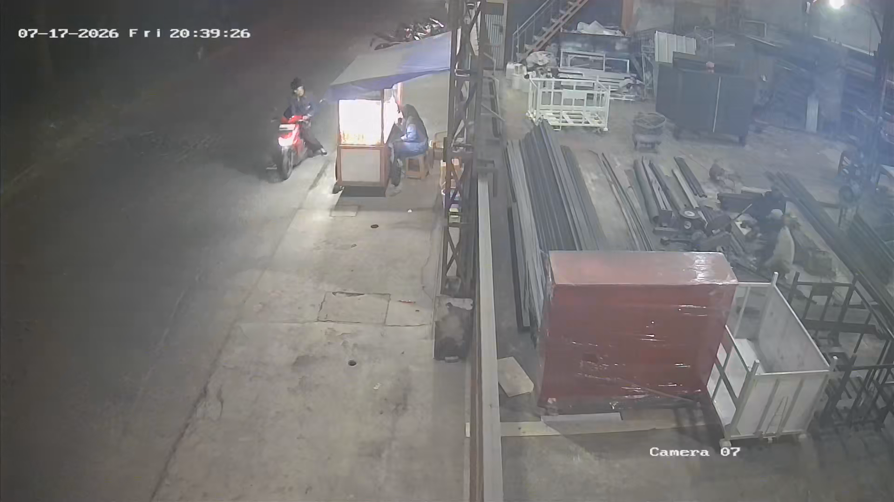 | 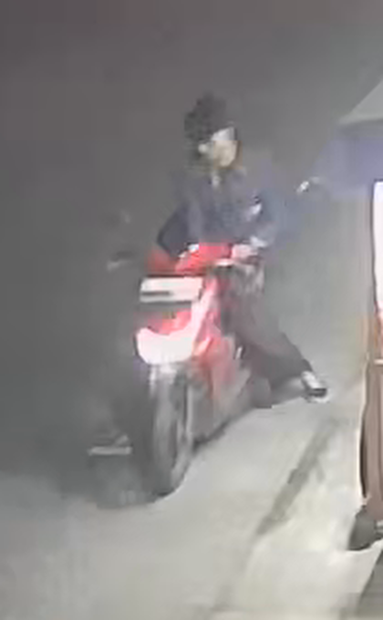 |

Plate crop mistake (lab-002 — fixed in `scripts/focus_regions.py` + `meta.json`):

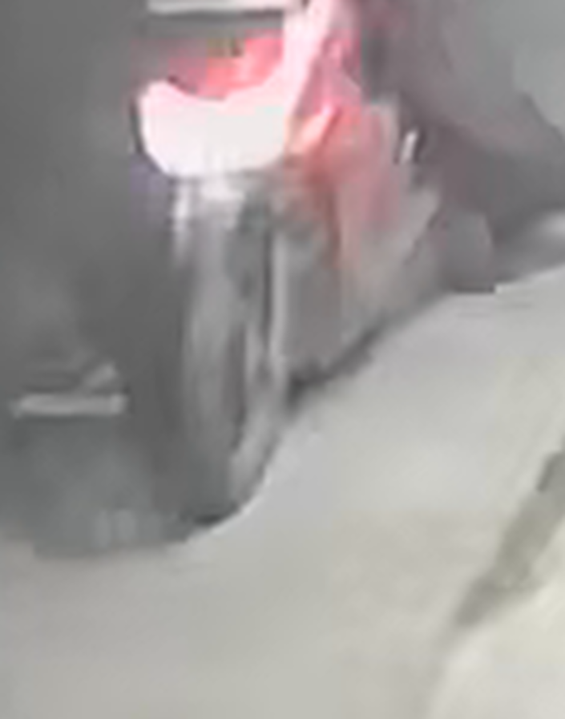

*Correct region: front fender below headlight (`y 0.55–0.73` in ROI). Verify `crops/plate_ref.png` before any plate chain.*

### Combined multi-tool run (lab-002, all stages)

One lab run tested **brighten → denoise → upscale → hybrid → CodeFormer** on the same ROI (`frame_002`). Categories: **A** baseline, **B** temporal/brighten, **C** upscale, **D** hybrid chains, **E** face generative.

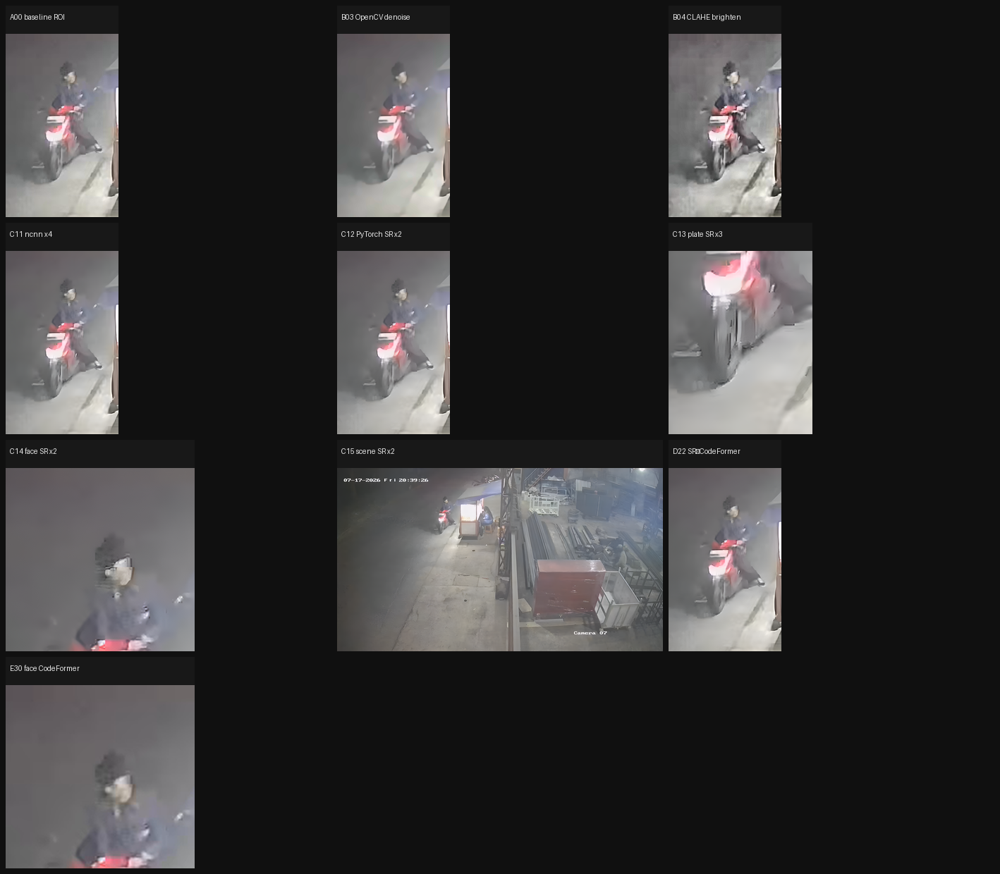

| Cat | Stage | Verdict (`frame_002`) |
|-----|-------|------------------------|
| **A** | Baseline ROI | Dark, noisy; plate unreadable |
| **B** | `B04-clahe-brighten` | **Best lighting lift** — rider + bike visible |
| **B** | `B03-opencv-denoise` | Softer; no ID gain |
| **B** | RVRT deblur/denoise | **Failed** — MSVC `cl` not in PATH |
| **C** | `C12-pytorch-sr-x2` | **Best motor sharpness** — fairing edges clearer |
| **C** | `C11-realesrgan-s4` (ncnn ×4) | OK but softer than PyTorch SR |
| **C** | `C13-plate-sr-x3` | **Failed** — wrong crop (tire) |
| **C** | `C14-face-sr-x2` | Marginal; face still blurry |
| **C** | `C15-scene-sr-x2` | Marginal stall context on full 1080p |
| **D** | `D22-sr-codeformer` | 0 faces detected |
| **E** | `E30-codeformer-facezoom` | 0 faces detected |

**Overall:** README goal **not achieved** — no readable plate characters or face features. Best forensic-safe combo: **`B04` brighten → `C12` PyTorch SR** on motor ROI.

### Per-focus comparisons (`frame_002`)

**Brighten** — `B04` wins; denoise alone too soft:

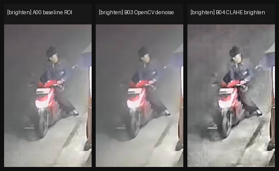

**Motor** — `C12` PyTorch SR ×2 sharpest fairing; use after `B04`:

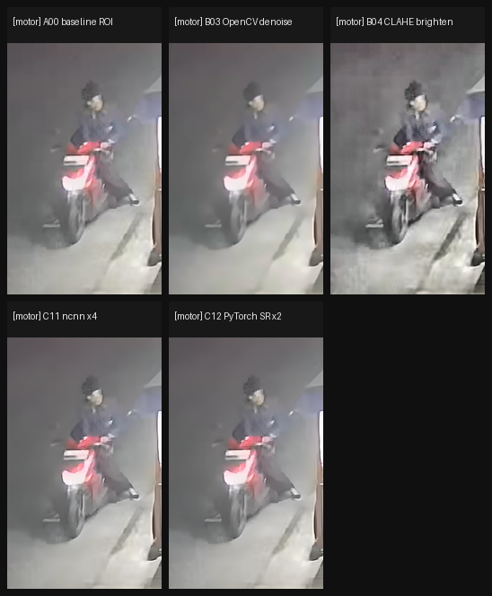

**Plate** — no winner; crop was wrong (tire). Re-test after `focus_regions` fix:

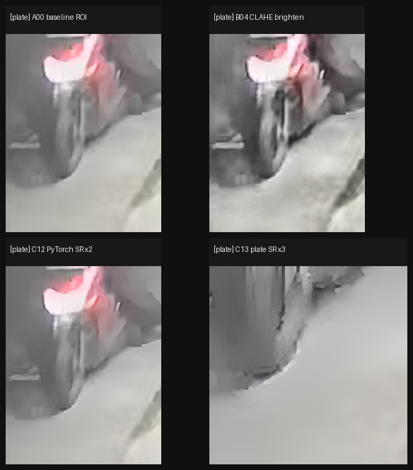

**Face** — `B04` best; CodeFormer 0 detections (investigative only, not forensic):

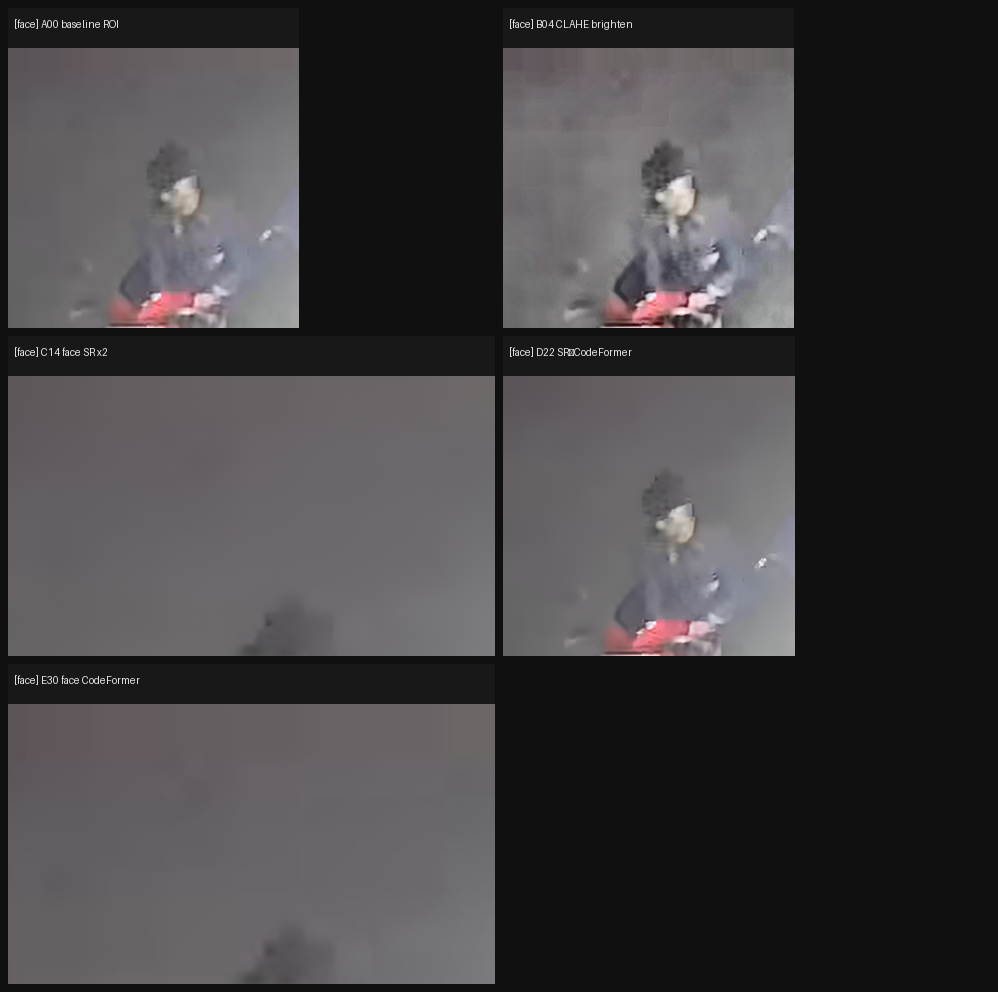

**Scene** — full-frame SR (`C15`) slight context gain:

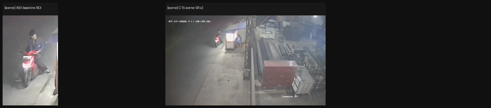

### How to combine tools (chains — default from lab-003+)

Do **not** upscale before brighten on dark CCTV. Run **one linear chain per goal**; final PNG per goal in `outputs/final/`.

```text
plate:  A crop plate (meta.json) → B CLAHE brighten → C PyTorch SR ×3 → final/
face:   A crop face (top of ROI) → B CLAHE → C PyTorch SR ×2 → D CodeFormer (optional) → final/
motor:  A baseline ROI → B CLAHE → Upscayl Ultrasharp ×2 (optional) → C PyTorch SR ×2 → final/
scene:  A full 1080p → C PyTorch SR ×2 → final/
brighten: A baseline → B CLAHE → final/
```

| Focus | Lab-002 winner | Recommended chain |
|-------|----------------|-------------------|
| brighten | `B04-clahe-brighten` | A → B |
| motor | `C12-pytorch-sr-x2` (after B04) | A → B → (Upscayl) → C |
| plate | *(none — wrong crop)* | A → B → C after `plate_ref.png` QA |
| face | `B04` marginally | A → B → C; CodeFormer when detections work |
| scene | `C15` marginally | A full → C |

Best frame for this clip: **`frame_002`** (`23:17.67`) — rider most centered.

## What we tried (summary)

| Approach | Tool | Result |

|----------|------|--------|

| Denoise + deblur | VRT | Slightly cleaner; **no identification gain** |

| Temporal deblur/denoise | RVRT | Similar to VRT; **no plate/face recovery** (cut-motor: MSVC blocked RVRT) |

| Multi-tool classified bakeoff | `bakeoff_hybrid.py` | cut-motor lab-002: B04+C12 best; plate crop bug; CodeFormer 0 faces |

| Upscale ncnn | Real-ESRGAN | Tile mosaic on some frames; anime models wrong for CCTV |

| Upscale ncnn | Upscayl | Stable frames; **identification still fails** |

| Forensic presets | `forensic_presets.py` | Evidence-safe (no SR); not sharp enough |

## Target pipeline (chained SOTA)

Single models are not enough. Each SOTA repo has a specialty. Chain them so output of one stage is input to the next — and **skip** stages when metrics say the frame does not need them.

> **Status:** This is the **target** adaptive pipeline. Bakeoffs so far still fail identification; do not treat GAN/CodeFormer output as forensic evidence.

### Baseline flow

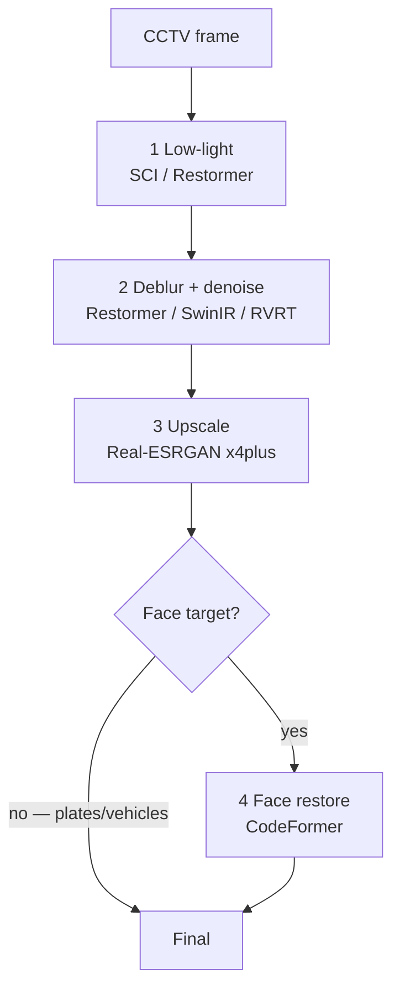

| Step | Job | Preferred tools | Notes |
|------|-----|-----------------|-------|
| 1 | Lift darkness | [SCI](https://github.com/vis-opt-group/SCI), [Restormer](https://github.com/swz30/Restormer) | Do **not** upscale dark frames first — noise scales with SR |
| 2 | Motion blur + compression noise | Restormer, [SwinIR](https://github.com/JingyunLiang/SwinIR), [RVRT](https://github.com/JingyunLiang/RVRT) | Transformers re-solidify smeared edges |
| 3 | Super-resolution / plates | [Real-ESRGAN](https://github.com/xinntao/Real-ESRGAN) `x4plus` | After clean+bright only |
| 4 | Face (optional) | [CodeFormer](https://github.com/sczhou/CodeFormer) | Zoomed ROI; skip for plate-only jobs |

### Adaptive improvements (smart pipeline)

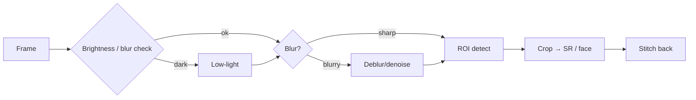

1. **Adaptive selector** — mean luminance + Laplacian variance; skip low-light if already bright; skip deblur if already sharp.
2. **ROI crop → enhance → stitch** — YOLO/RetinaFace locate plate/face; run DL on a small crop (saves VRAM vs full-frame 8K SR).
3. **Multi-frame temporal fusion** — ±2 neighbor frames via RVRT / BasicVSR++ so clearer frames fill motion-blurred digits.
4. **Face soft-mask** — Real-ESRGAN on crop background + CodeFormer on face, alpha-blend so clothes/background stay natural.

Agent workflow skill: [`.cursor/skills/cctv-adaptive-pipeline/SKILL.md`](.cursor/skills/cctv-adaptive-pipeline/SKILL.md).

## Repo layout

| Path | Purpose |

|------|---------|

| `Original/` | Source CCTV (bit-exact; do not alter) |

| `Original/packs/` | ZIP archives for files >100MB |

| `work/bakeoff/cut2/` | Comparison images for README (indoor face clip) |
| `work/bakeoff/cut-motor-2308/` | Comparison images for README (motorcycle stall clip) |

| `scripts/` | `pack_original.py`, `restore_cctv.py`, `bakeoff_*`, `build_bakeoff_docs.py` |

| `tools/README.md` | How to install gitignored tools |

| `work/datasets/` | Immutable source frames (`src/`, `crops/`, `meta.json`) |
| `work/labs/` | Numbered test sessions (`lab-001-*`, `lab-002-*`, …) — never overwrite |
| `work/labs/cut2/lab-001-historical-upscayl/` | cut2 bakeoff winner lab |
| `work/labs/cut-motor-2308/lab-002-goal-plate-face-motor-scene/` | Motor ROI multi-focus bakeoff (plate/face/motor/scene/brighten) |

| `.cursor/skills/` | Agent workflows (VRT, RVRT, Real-ESRGAN, CodeFormer, adaptive pipeline) |

## Commands

### Install tools (once)

See [tools/README.md](tools/README.md). RVRT on Windows also needs CUDA Toolkit + MSVC — use `scripts\run_rvrt_deblur.bat`.

### Pack Original (forensic — no re-encode)

```bash

python scripts/pack_original.py Original/ch07.mp4 Original/ch09.mp4

python scripts/pack_original.py --unpack Original/packs/ch07.mp4

```

### VRT smoke test

```bash

python scripts/restore_cctv.py --input Original/CUT/cut2.mkv --preset forensic-blur --max-frames 24

```

### RVRT bakeoff (cut2 frames)

```bat

scripts\run_rvrt_deblur.bat

scripts\run_rvrt_denoise.bat

python scripts\build_bakeoff_docs.py

```

### Real-ESRGAN (try `-t 128` if tile mosaic appears)

```powershell

tools\realesgan\realesrgan-ncnn-vulkan.exe -i work\cut2-bakeoff\src -o work\cut2-bakeoff\outputs\01-realesrgan-x4plus-s2 -n realesrgan-x4plus -s 2 -g 1 -f png -t 128

```

### Classified / chains bakeoff (cut-motor-2308)

```powershell
# Linear A→B→C→D per goal + outputs/final/ (recommended)
python scripts/bakeoff_hybrid.py --dataset cut-motor-2308 --new-lab "chains-v3" --mode chains

# Full tool matrix (13+ folders under outputs/explore/)
python scripts/bakeoff_hybrid.py --dataset cut-motor-2308 --new-lab "explore-all" --mode explore

# Rebuild compare/ grids only
python scripts/bakeoff_hybrid.py --dataset cut-motor-2308 --lab lab-002-goal-plate-face-motor-scene --compare-only
```

Extract ROI frames from video (stall phase):

```powershell
python scripts/extract_roi_bakeoff.py --start 23:17.33 --end 23:18 --out work/datasets/cut-motor-2308
```

### Upscayl bakeoff

```bash

python scripts/bakeoff_upscayl.py

python scripts/bakeoff_upscayl.py --skip-upscale   # rebuild comparison PNGs only

```

## work/ layout (committed bakeoff data)

```

work/

├── bakeoff/cut2/              # README images (indoor face)

├── bakeoff/cut-motor-2308/    # README images (motor stall)

├── datasets/cut-motor-2308/   # Immutable src/, full/, crops/, meta.json

├── labs/cut-motor-2308/       # lab-002-goal-plate-face-motor-scene/ (etc.)

├── cut2-bakeoff/              # legacy pointer — see work/labs/cut2/

└── archive/                   # older runs — gitignored (too large)

```

## Help wanted

Focus on **readable plates/faces**, not “looks HD”.

1. Temporal stacking before SR
2. Plate-specific / LPR models
3. Fix Real-ESRGAN tiling (`-t`, or use upscayl-bin)
4. ROI hybrid: RVRT/VRT deblur + upscale only on crops
5. OCR-based evaluation (EasyOCR / PaddleOCR)
6. Do not present full-frame GAN upscale as forensic evidence without disclosure
7. Adaptive brightness/blur gates (skip low-light / deblur when not needed)
8. Soft-mask blend: Real-ESRGAN background + CodeFormer face

### Contributing

1. Open an **issue** with clip, model, settings, **crop comparisons**
2. **PRs** for scripts, `work/bakeoff/`, eval harnesses
3. Say what became readable that was not before

## Git policy

| Path | Policy |

|------|--------|

| `Original/ch07.mp4` | gitignored — commit `Original/packs/ch07.mp4/*` |

| `work/` | committed (bakeoff data + comparison images) |

| `work/archive/`, `work/_tmp*/` | gitignored (bulky / temp) |

| `tools/` | gitignored (except `tools/README.md`) |

| `Restored/` | gitignored |

## Licenses

- **VRT / RVRT** — [CC-BY-NC](https://github.com/JingyunLiang/VRT)  
- **Real-ESRGAN** — [xinntao/Real-ESRGAN](https://github.com/xinntao/Real-ESRGAN)  
- **Upscayl / upscayl-ncnn** — AGPL-3.0

## Citation (VRT / RVRT)

```

@article{liang2022vrt,

  title={VRT: A Video Restoration Transformer},

  author={Liang, Jingyun and Cao, Jiezhang and Fan, Yuchen and Zhang, Kai and Ranjan, Rakesh and Li, Yawei and Timofte, Radu and Van Gool, Luc},

  journal={arXiv preprint arXiv:2201.12288},

  year={2022}

}

@article{liang2022rvrt,

  title={Recurrent Video Restoration Transformer with Guided Deformable Attention},

  author={Liang, Jingyun and Fan, Yuchen and Xiang, Xiaoyu and Ranjan, Rakesh and Ilg, Eddy and Green, Simon and Cao, Jiezhang and Zhang, Kai and Timofte, Radu and Van Gool, Luc},

  journal={arXiv preprint arXiv:2206.02146},

  year={2022}

}

```

---

**TL;DR:** Public CCTV enhancement experiment. **No winning pipeline yet** for plate/face OCR. cut2: Upscayl beats Real-ESRGAN ncnn on coherence. cut-motor-2308: **B04 brighten + C12 PyTorch SR** best for motor ROI; plate crop was wrong in lab-002 (fixed in scripts). Contributors welcome.